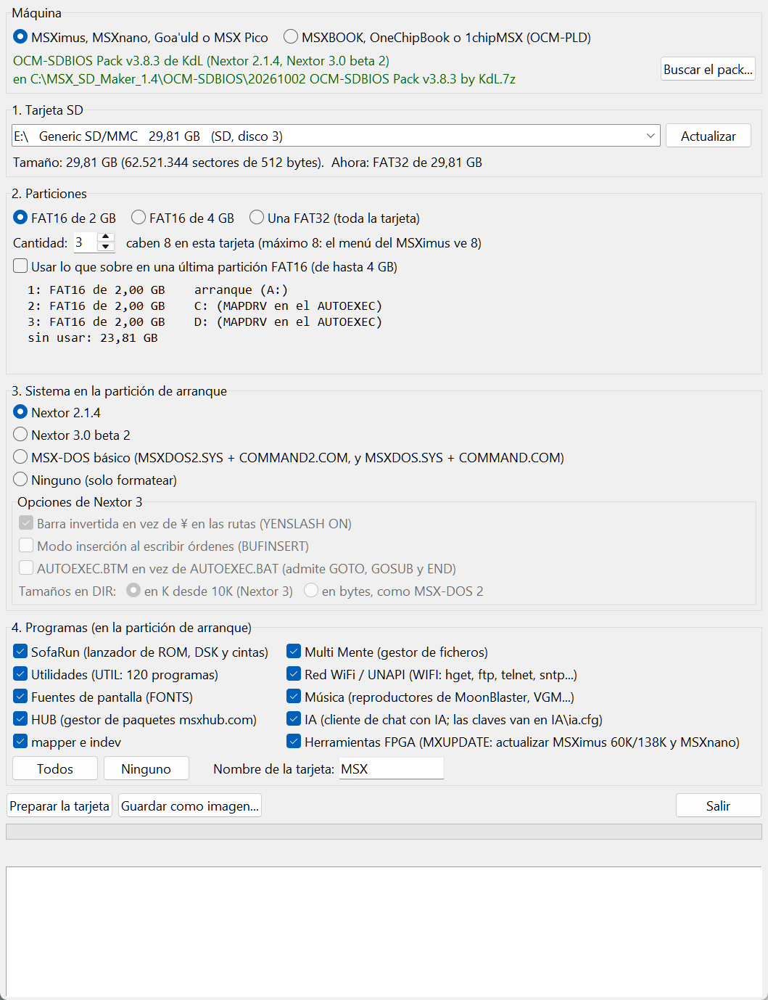
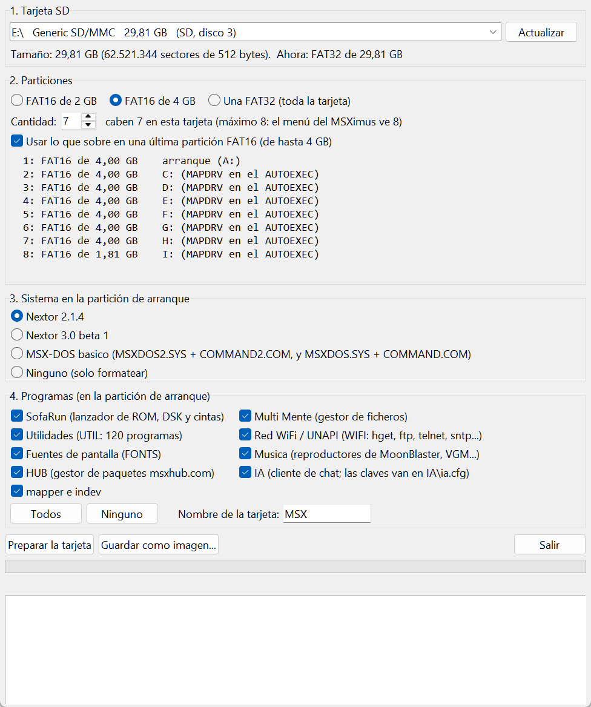
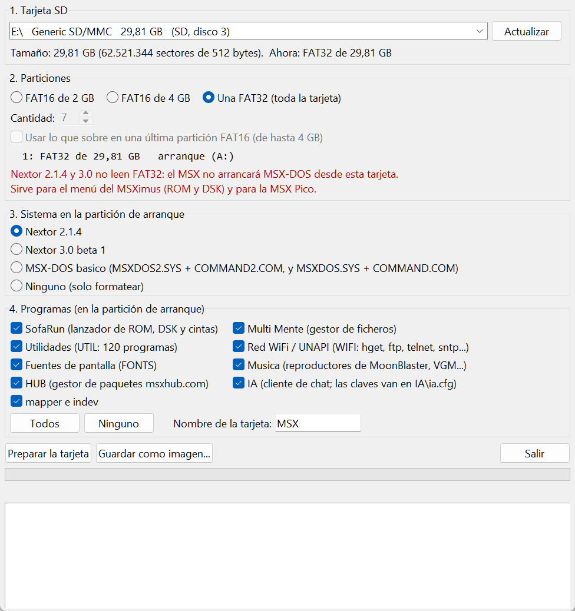
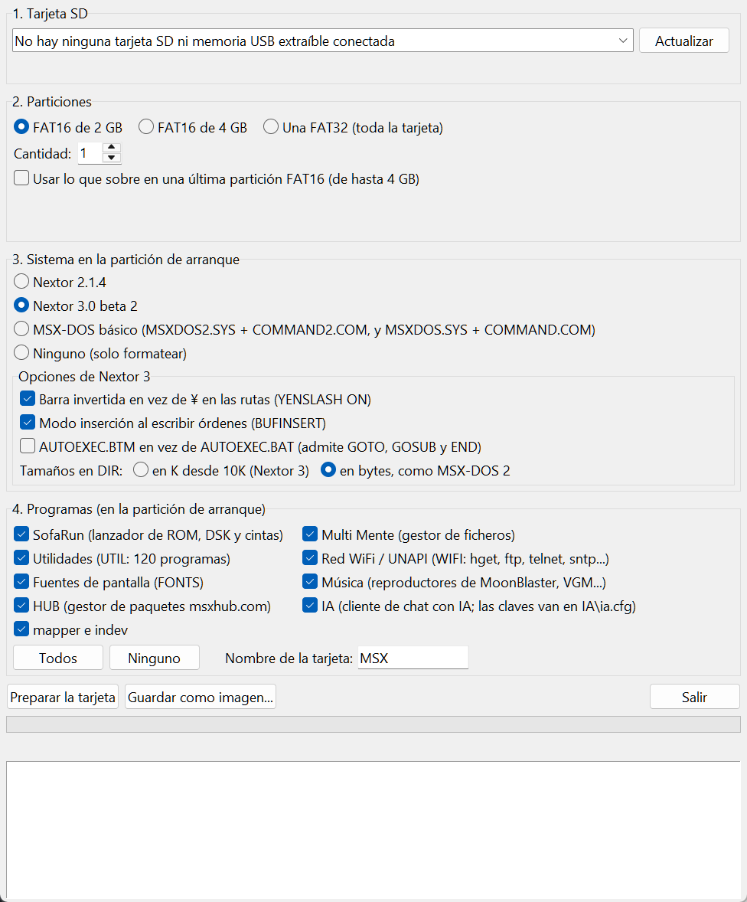
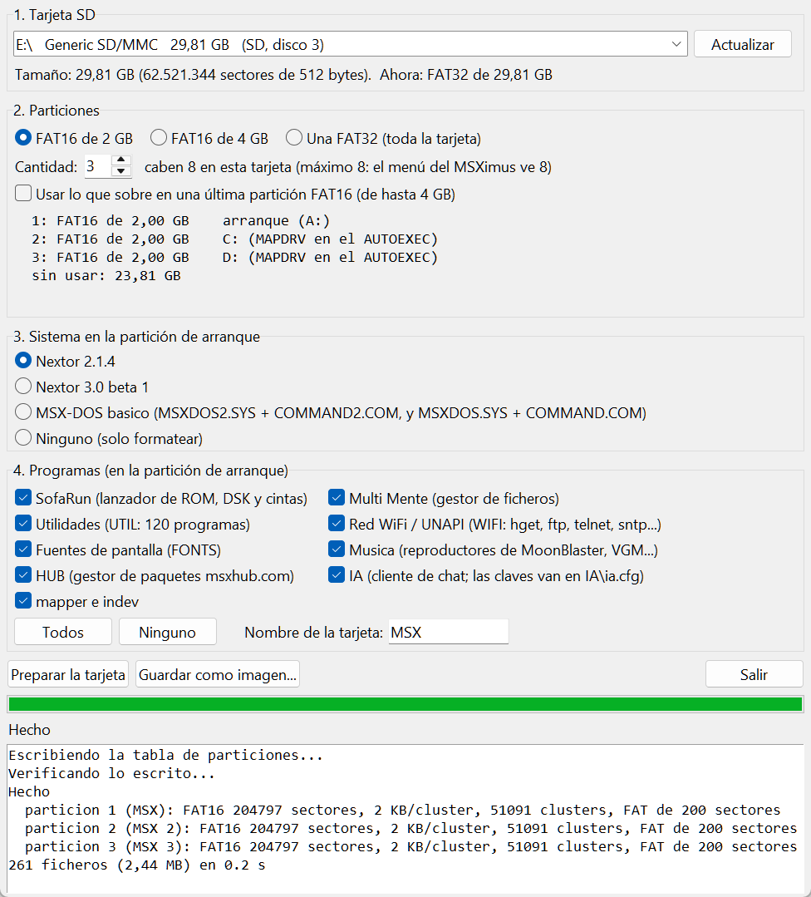

# MSX SD Maker 1.2 — preparing the SD card

*[Versión en castellano](LEEME.md)*

**MSX SD Maker** gets an SD card ready for an **MSXimus** (Tang Console 60K, Tang Mega 138K or the Zynq version), an **MSXnano** or an **MSX Pico**. In a few seconds it does all this:

1. Wipes the card and splits it into partitions that MSX-DOS understands.
2. Formats each partition.
3. Copies the operating system (Nextor or MSX-DOS) to the first partition.
4. Copies a set of programs: SofaRun, Multi Mente, utilities, networking, music…
5. Writes an `AUTOEXEC.BAT` that sets everything up at boot.
6. Reads everything back to check that the card came out right.

Nothing to install: it is a single file, `MSXsdmaker.exe`. The program itself is in Spanish; this guide explains every option.

---

## Contents

1. [What you need](#1-what-you-need)
2. [Opening the program](#2-opening-the-program)
3. [Step by step](#3-step-by-step)
4. [What ends up on the card](#4-what-ends-up-on-the-card)
5. [First boot on the MSX](#5-first-boot-on-the-msx)
6. [Adding games and programs](#6-adding-games-and-programs)
7. [Saving an image instead of a card](#7-saving-an-image-instead-of-a-card)
8. [Troubleshooting](#8-troubleshooting)
9. [For the curious: how it works](#9-for-the-curious-how-it-works)
10. [Licenses and credits](#10-licenses-and-credits)

---

## 1. What you need

- **A PC with Windows 10 or 11.**
- **A card reader**: the laptop's own or a USB one.
- **An SD or microSD card of 4 GB or more.** 8 to 32 GB is the most practical. Bigger cards work too, but with FAT16 only 8 partitions are used.
- **To know which Nextor version your machine runs.** It depends on the BIOS pack or the `BOOT` file you flashed. See [step 3.3](#33-the-system).

> ⚠️ **The program wipes the whole card.** If it holds anything you want to keep, copy it to the PC first.

---

## 2. Opening the program

1. Download the ZIP from the [latest MSX SD Maker release](https://github.com/Papipapito/SD_Maker/releases/latest) (`MSX_SD_Maker_<version>.zip`), in its own repository ([SD_Maker](https://github.com/Papipapito/SD_Maker)), and **unzip it** anywhere: inside there is `MSXsdmaker.exe` with this guide. The machines' repositories also carry a copy in their `MSXsdmaker` folder.
2. Put the card in the reader.
3. Double-click `MSXsdmaker.exe`.
4. Windows asks whether to allow it to make changes to the device: answer **Yes**. It needs this because it writes the whole card, partition table included.

**If Windows shows "Windows protected your PC"** (SmartScreen): click **More info** and then **Run anyway**. It appears because the program is not digitally signed.

**If your antivirus complains**: Python programs packed into a single `.exe` sometimes trigger false positives. The source code is in [SD_Maker](https://github.com/Papipapito/SD_Maker) (and a copy in the `fuente/` folder).

---

## 3. Step by step



The window has four blocks, top to bottom. Fill them in order and press **Preparar la tarjeta** (*Prepare the card*).

### 3.1 The card — *1. Tarjeta SD*

The list at the top shows the connected cards: drive letter, reader name, size and type. If you have just inserted the card and it is not there, press **Actualizar** (*Refresh*).

Below it you see the exact size and what is on the card now (*Ahora*), for example "FAT32 de 29,81 GB".

> 🛡️ **Only SD card readers and removable USB sticks are listed.** The disk Windows lives on never appears, and neither do external hard disks. Still, check the size carefully before going on.

### 3.2 The partitions — *2. Particiones*

A **partition** is a slice of the card that the MSX sees as a separate drive (A:, C:, D:…). MSX-DOS cannot handle huge disks, so the card is split into slices it does understand.

| Option | Size of each partition | What it is for |
|---|---|---|
| **FAT16 de 2 GB** | 2 GB | **The recommended choice.** Every file takes at least 32 KB, so little is wasted on small ROM and DSK files. |
| **FAT16 de 4 GB** | 4 GB, the Nextor maximum | Fewer, bigger partitions. Every file takes at least 64 KB. |
| **Una FAT32** | The whole card | Only for the MSXimus menu (ROM and DSK) and the MSX Pico. **MSX-DOS cannot see it** (see the warning below). |

**Cantidad** (*count*). The program tells you how many partitions fit on your card and does not let you go beyond that. The maximum is 8, the number the MSXimus menu walks through.

**"Usar lo que sobre en una última partición FAT16"** (*use the leftover space in one last FAT16 partition*). Tick it so the end of the card is not wasted: one more, smaller partition is created with what is left (up to 4 GB). If you leave it unticked, that space stays unused and neither Windows nor the MSX sees it.

Below you see how the card will end up. For example (*arranque* = boot, *sin usar* = unused):

```
  1: FAT16 de 2,00 GB    arranque (A:)
  2: FAT16 de 2,00 GB    C: (MAPDRV en el AUTOEXEC)
  3: FAT16 de 2,00 GB    D: (MAPDRV en el AUTOEXEC)
  sin usar: 23,81 GB
```

How many fit on the most common cards (their real capacity is a bit less than the label says):

| Card | FAT16 2 GB | + leftover | FAT16 4 GB | + leftover |
|---|---|---|---|---|
| 2 GB | 1 with the whole card | — | 1 with the whole card | — |
| 4 GB | 1 | + 1 of 1.7 GB | 1 with the whole card | — |
| 8 GB | 3 | + 1 of 1.4 GB | 1 | + 1 of 3.4 GB |
| 16 GB | 7 | + 1 of 0.8 GB | 3 | + 1 of 2.8 GB |
| 32 GB | 8 | — | 7 | + 1 of 1.7 GB |
| 64 GB or more | 8 | — | 8 | — |



> ⚠️ **FAT32 and MSX-DOS.** Neither Nextor 2.1.4 nor Nextor 3.0 can read FAT32 partitions. With a FAT32 card the MSX **will not boot MSX-DOS** from it; you get the MSXimus menu or BASIC. On the MSXimus, the menu also cannot download from File-Hunter or save cartridge SRAM on FAT32: it only launches ROM and DSK files. Choose it only for that, or for the MSX Pico.
>
> 

### 3.3 The system — *3. Sistema en la partición de arranque*

This is the operating system copied to the first, boot partition. **It must match the Nextor your machine runs**; otherwise the MSX never reaches MSX-DOS.

| Your machine | If you flashed… | Choose |
|---|---|---|
| MSXimus 60K or 138K | `pack_bios_msximus.bin` or `pack_bios_msximus_en.bin` | **Nextor 2.1.4** |
| MSXimus 60K or 138K | `pack_bios_msximus_nextor3.bin` or `…_en_nextor3.bin` | **Nextor 3.0 beta 2** |
| MSXimus Z (Zynq) | a `BOOT_…_nextor214.bin` | **Nextor 2.1.4** |
| MSXimus Z (Zynq) | a `BOOT_…_nextor3.bin` | **Nextor 3.0 beta 2** |
| MSXnano | `pack_bios_msxnano.bin` or `pack_bios_msxnano_en.bin` | **Nextor 2.1.4** |
| MSXnano | `pack_bios_msxnano_nextor3.bin` or `…_en_nextor3.bin` | **Nextor 3.0 beta 2** |
| Goa'uld | `pack_bios_goauld_es.bin` or `pack_bios_goauld_en.bin` | **Nextor 2.1.4** |
| MSX Pico or another MSX with Nextor 2.1 | — | **Nextor 2.1.4** |

The other two options:

- **MSX-DOS básico** (*basic MSX-DOS*): only `MSXDOS2.SYS` and `COMMAND2.COM`, plus MSX-DOS 1's `MSXDOS.SYS` and `COMMAND.COM`, without the Nextor tools. Without them the `AUTOEXEC` cannot mount C:, D:…; do it by hand with `CALL MAPDRV` from BASIC.
- **Ninguno (solo formatear)** (*none, format only*): partitions and formats, with no system and no programs. Handy for a games-only card.

If the card is smaller than a whole partition ("2 GB" cards hold a little under 2 GB), a single partition with the whole card is made.

**Nextor 3 options** (*Opciones de Nextor 3*). With Nextor 3 a box with four boot options is enabled:

| Option | What it does | Default |
|---|---|---|
| Backslash instead of ¥ (`YENSLASH ON`) | Paths show as `A:\DIR\FILE` instead of with the yen sign of Japanese MSX computers. Since beta 2, `YENSLASH` is a command of `COMMAND3.COM` itself | Ticked |
| Insert mode (`SET BUFINSERT=ON`) | What you type at the prompt is inserted instead of overwriting. INS toggles, as always | Not ticked |
| `AUTOEXEC.BTM` instead of `AUTOEXEC.BAT` | `COMMAND3.COM` loads it whole, so it accepts `GOTO`, `GOSUB`, `RETURN` and `END` | Not ticked |
| Sizes in DIR | In K from 10K (Nextor 3's way) or always in bytes, like MSX-DOS 2 (`SET DIRK=0`). `DIRB` always shows bytes | In K |



> ℹ️ MSX-DOS 1 only boots from FAT12 partitions of 16 MB or less, which is not what this program creates. That is why any of these options boots MSX-DOS 2; the MSX-DOS 1 files are there only in case you need them.

### 3.4 The programs — *4. Programas*

They are copied to the first partition, each in its own folder. Tick the ones you want; **Todos** (*all*) and **Ninguno** (*none*) help.

| Checkbox | Folder | What it is | How to start it |
|---|---|---|---|
| SofaRun | `SOFARUN` | ROM, DSK and CAS tape launcher with a menu, by Louthrax | `SR` |
| Multi Mente | `MM` | Two-pane file manager | `MM` |
| Utilidades | `UTIL` | About 120 tools: `DI` (DIR with long names), `LOGIN`, players, copying… | by name |
| Red WiFi / UNAPI | `WIFI` | TCP/IP networking: `HGET`, `FTP`, `TELNET`, `SNTP`, `FH` (File-Hunter)… | by name |
| Fuentes de pantalla | `FONTS` | Fonts for Multi Mente (ISO Latin-1, Japanese, Russian…) | used by MM |
| Música | `musica` | MoonBlaster Wave, VGM and other players | by name |
| HUB | `hub` | MSX Hub client, to install programs from the internet | `HUBG` or `HUB` |
| IA | `IA` | AI chat client; your keys go in `IA\ia.cfg` | `IA` |
| mapper e indev | `mapper`, `indev.com` | `MAPPER` disables the MSX-DOS 2 mapper routines for old software | by name |
| Herramientas FPGA | `FPGA` | `MXUPDATE`: updates the core and the pack of the MSXimus 60K/138K and the MSXnano (2.1.1 or later) from MSX-DOS, from a `.UPD` on the card or over WiFi (`MXUPDATE /N`); over WiFi it first brings itself up to date. `MXUPDATE /?` shows the commands. The MSXimus Z (Zynq) updates itself | `MXUPDATE` |

Whenever a system is installed these empty folders are created too. **Do not delete them**:

- `FHUNT`: where the MSXimus menu saves what it downloads from File-Hunter. The menu cannot create folders, so it must exist.
- `TMP`: temporary folder for MSX-DOS and SofaRun.
- `SAVES` and `SETTINGS`, if you ticked SofaRun: its saved games and its settings.

**Nombre de la tarjeta** (*card name*): the name of partition 1 as shown in Windows and by `VOL` in MSX-DOS. The others get the same name with their number: "MSX 2", "MSX 3"…

### 3.5 Preparing

1. Press **Preparar la tarjeta**.
2. The program shows **what it is going to wipe** (the card's name, size and drives) and **what it will create**. Read it carefully. It only goes ahead if you answer **Sí** (*Yes*); the default button is No.
3. The bar moves while it works. It takes a few seconds; somewhat longer with FAT32 on big cards.
4. At the end it **verifies**: it reads back the partition table and every copied file and compares them with what it meant to write. If everything matches it says **"La tarjeta está lista y verificada"** (*the card is ready and verified*).
5. Windows mounts the card again by itself. Each partition shows up with its own drive letter.



You can take the card out now. Use "Eject" in Windows first, as with any memory stick.

---

## 4. What ends up on the card

**Partition 1** (A: on the MSX), with Nextor 2.1.4 and every program:

```
A:\
├── NEXTOR.SYS, COMMAND2.COM       the system (with Nextor 3: COMMAND3.COM)
├── MSXDOS2.SYS, MSXDOS.SYS…       fallback system files
├── AUTOEXEC.BAT                   runs at boot (see below)
├── bin\                           Nextor tools: MAPDRV, DRIVERS, DEVINFO…
├── SOFARUN\  SAVES\  SETTINGS\    SofaRun and its folders
├── MM\  FONTS\                    Multi Mente and its fonts
├── UTIL\  WIFI\  musica\          utilities, networking and music
├── hub\  IA\  mapper\  indev.com
├── FPGA\                          MXUPDATE: updating the MSXimus and MSXnano core
├── FHUNT\                         File-Hunter downloads (do not delete)
└── TMP\                           temporary (do not delete)
```

**Partitions 2, 3…** are left empty for your games and programs.

### The AUTOEXEC.BAT

It is generated from your choices. With everything ticked and three partitions it looks like this:

```
PATH A:\;%1\BIN;%1\SOFARUN;%1\MM;%1\UTIL;%1\WIFI;%1\musica;%1\hub;%1\IA;%1\mapper;%1\FPGA
SET TIMEZONE=+02:00
mode 80
ALIAS .BAS = "BASIC "
ALIAS .ASC = "BASIC "
sntp pool.ntp.org /v
set temp %1\TMP
set MM=%1\MM
alias .ROM srom
alias .DSK sri
yenslash
SET FONT0808=%1\FONTS\ISO-LAT1.FNT
echo Type LOGIN to show system info (not for MSX1!)
echo Type DI for DIR with long filenames
echo Type SR to start Sofarun
echo Type MM to start Multi Mente
echo Type HUBG to start HUB Gui or HUB to CLI
echo Type FH to FileHunter Download
echo
echo Maped Units C,D
mapdrv c: 2 1 0
mapdrv d: 3 1 0
```

What each part does:

- **`PATH`**: you can type any program's name from any folder, without its path. `%1` is the boot drive.
- **`SET TIMEZONE`**: the time zone (+02:00, Central European summer time). Change it if needed.
- **`mode 80`**: 80-column screen.
- **`ALIAS`**: typing the name of a `.BAS` opens it in BASIC; the name of a `.ROM` or `.DSK` launches it with SofaRun.
- **`sntp`**: sets the clock from the internet if there is a network. Without one it prints an error and carries on: that is normal.
- **`mapdrv c: 2 1 0`**: mounts partition 2 as drive C:, partition 3 as D:, and so on.

With **Nextor 3**, instead of `yenslash` come the lines of its options (`YENSLASH ON`, plus `SET BUFINSERT=ON` and `SET DIRK=0` if ticked), and the file is `AUTOEXEC.BTM` if you choose that option.

You can edit `AUTOEXEC.BAT` from Windows with Notepad. Keep its name.

---

## 5. First boot on the MSX

1. Put the card in the machine and switch it on.
2. **MSXimus and MSXnano**: if "Menú al arrancar" (*menu at boot*) is on in the Settings, the card browser appears.
   - The bottom line shows which partition you are in, for example `P1/3`. **TAB** moves to the next one.
   - **R**, **D** and **A** filter by ROM, DSK or all.
   - **ESC** leaves the menu and boots MSX-DOS from the card.
3. MSX-DOS boots, runs `AUTOEXEC.BAT` and stops at `A:\>`. Something like this (tested on an MSXimus Z with a three-partition card):

```
SNTP time setter for the TCP/IP UNAPI 1.1
*** ERROR: Unknown error when opening UDP connection (code 15)      <- no network: normal
Type LOGIN to show system info (not for MSX1!)
Type DI for DIR with long filenames
Type SR to start Sofarun
Type MM to start Multi Mente
Type HUBG to start HUB Gui or HUB to CLI
Type FH to FileHunter Download

Maped Units C,D
A:\>vol c:
 Volume in drive C: is MSX 2
A:\>vol d:
 Volume in drive D: is MSX 3
```

Useful commands to start with:

| Type | To |
|---|---|
| `SR` | SofaRun: pick and launch ROM, DSK and tapes |
| `MM` | Multi Mente: copy, move and delete files |
| `DI` | List the folder with long names |
| `DIR C:` | See what is on partition 2 |
| `LOGIN` | System information |
| `BASIC` | Go to MSX-BASIC |

---

## 6. Adding games and programs

With the card in the PC, each partition is a Windows drive. Copy files by dragging them, as with any USB stick.

A convenient way to organise it:

| Partition | On the MSX | For |
|---|---|---|
| 1 | A: | System and programs (leave it as it is) |
| 2 | C: | Cartridge ROMs |
| 3 | D: | DSK disk images |
| 4 | E: | Music, pictures, anything |

Good to know:

- **Long names.** The MSXimus menu and Windows show them in full, like "Aleste 2 (1988).rom". MSX-DOS and SofaRun see the 8+3 short name Windows generates, like `ALESTE~1.ROM`.
- **The MSXimus menu** walks every partition with TAB and launches ROM and DSK files without going through MSX-DOS.
- **Do not format the partitions from Windows.** Windows would change their format or cluster size. To start over, run the card through MSX SD Maker again.
- **Do not delete `FHUNT` or `TMP`** from partition 1.

---

## 7. Saving an image instead of a card

**Guardar como imagen…** (*save as image*) creates an `.img` file with the whole card instead of writing it. Useful to:

- Prepare several identical cards: write the image with Rufus, balenaEtcher or Win32 Disk Imager.
- Try it in an emulator.
- Keep a copy of a setup.

The program asks for the image size. An image can be written to a card of that size **or larger**, never smaller, and cards hold a little less than their label says: `1800M` fits any 2 GB card and `3500M` any 4 GB card. The image only takes up on the PC's disk what was really written, not its whole size.

Every MSXimus release also ships a ready-made image with Nextor 3 (1800 MB, all programs): just write it.

---

## 8. Troubleshooting

**The card is not in the list.**
Check it is properly inserted and press **Actualizar**. Only SD readers and removable USB sticks are listed. Some USB-SATA or USB-NVMe adapters present themselves as fixed disks and are left out on purpose.

**"La unidad E: está en uso: cierra lo que la tenga abierta"** (*drive E: is in use: close whatever has it open*).
Close the Explorer windows showing the card and any program with files open on it. Try again.

**The program says it needs administrator rights.**
Open it by double-clicking and answer **Yes** in the Windows prompt.

**The MSX never reaches MSX-DOS.**
- Does the system you chose match your machine's BIOS pack or `BOOT` file? See the table in [step 3.3](#33-the-system).
- Did you choose FAT32? MSX-DOS cannot read it.
- Is "Menú al arrancar" on? Then the menu comes first: press **ESC**.

**C: and D: do not appear in MSX-DOS.**
With "MSX-DOS básico" the Nextor tools are not copied, so the `AUTOEXEC` cannot mount them. Do it from BASIC with `CALL MAPDRV`, or prepare the card again with Nextor.

**"ERROR … opening UDP connection" at boot.**
That is `SNTP` trying to set the clock from the internet with no network. It does not affect anything. If it bothers you, delete that line from `AUTOEXEC.BAT`.

**The verification found errors.**
The card or the reader may be failing. Try again and, if it happens again, with another reader or another card.

**Can I have more than 8 partitions?**
No. The MSXimus menu sees 8, and Nextor only looks at the first 9 at boot.

**Windows says the card is smaller than its label.**
That is normal: manufacturers count 1 GB as 1,000 million bytes and Windows as 1,073 million.

**Does it touch anything on my PC?**
No. It only writes to the card you choose, and the Windows disk never appears in the list.

---

## 9. For the curious: how it works

- **It splits the card the same way as Nextor's `FDISK`**, the tool you open with `CALL FDISK`. Partition 1 is primary, active and starts at sector 1. The rest are logical partitions inside an extended one. That way Nextor numbers them 1, 2, 3… and `MAPDRV` finds them.
- **FAT16 uses the geometry of Nextor's `FDISK`**: clusters from 2 to 64 KB depending on the size, at most 65,524 clusters and 512 root entries.
- **FAT32** starts at sector 8192, with the data aligned to 4 MB, as the SD Association formatter does.
- **Names**: it stores the 8+3 short name MSX-DOS reads and, when needed, also the long name Windows and the menu show.
- **The partition table is written last**, once everything else is in place. Then everything is read back and every file is compared by its CRC32.

The source code and the card contents are in [SD_Maker](https://github.com/Papipapito/SD_Maker); the machines' repositories carry a copy of the program in [`fuente/`](fuente/) (Python 3 with tkinter; `construir_exe.bat` builds the `.exe` with PyInstaller). To run it without the `.exe` you need the card contents in an `sd/` folder next to `MSXsdmaker.py`, with `base/`, `nextor-2.1.4/`, `nextor-3.0.0-beta2/` and `extras/`. The `.exe` already carries them. From the command line it can also make images:

```
python MSXsdmaker.py imagen test.img --tamano 8G --esquema fat16-2g --n 3 --sistema nextor214 --programas todos
```

---

## 10. Licenses and credits

MSX SD Maker is part of the MSXimus / MSXnano project, by Albert (Papipapito), under GPL v3 like the rest of the project.

The programs it copies to the card belong to their authors: Nextor and MSX-DOS, SofaRun, Multi Mente, the UNAPI tools, HUB and more. See [LICENCIAS.md](LICENCIAS.md): it has the list and the Nextor license notice, which must accompany its files.
